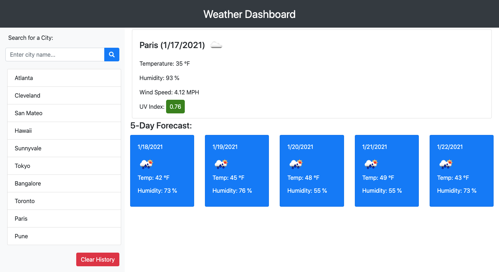

# Weather Dashboard
#### Version 1.0

### Description:
An web application that can be used to retrieve weather data for cities all over the world. It makes use of Third-party APIs to access the data and functionality by making requests with specific parameters to a URL. This app will run in the browser with features dynamically updated HTML and CSS.

### Technologies used:
- HTML
- CSS
- JavaScript
- jQuery
- Bootstrap-4
- Font-Awesome

### First glance of the app:

### Features:
1. User is presented with a form where cityname is searched for. 
2. Using the search input, the app makes a call to the [OpenWeather API](https://openweathermap.org/api) and loads the response for current day and also the forecast for the next 5-days.
3. Following data are shown in the current-day response which is loaded dynamically
    1. city name
    2. current date
    3. an icon representation of weather conditions
    4. temperature
    5. humidity
    6. wind speed
    7. UV index
4. UV index value is presented with a color that indicates whether the conditions are favorable(1-2: green), moderate(3-5: yellow-orange) high (6-7: red-orange), severe (7-9: red) or extreme(11+: darkpurple)
    - Resources used for color representation
     1. [EPA/SunSafety](https://www.epa.gov/sunsafety/uv-index-scale-0)
     2. [EPA/SunSafety](https://www.epa.gov/sites/production/files/documents/uviguide.pdf)
     3. [Dreamstime](https://www.dreamstime.com/illustration/uv-index.html)  
5. Future weather conditions for the city searched is shown for 5-days
6. Following data are shown in the 5-day forecast response which is loaded dynamically
    1. date
    2. an icon representation of weather conditions
    3. temperature
    4. humidity
7. Searched cities are stored in local storage.
8. User can select/click on cities from the search history to view the weather response.
9. This app will run in the **browser** - Chrome and Mozilla-Firefox

### Hosted here:
https://archana-nagaraj.github.io/Weather-Dashboard/

### Contributors
<a href="https://github.com/archana-nagaraj">

